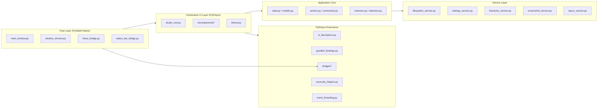

# Studio System Design Document

Document ID: `SDD-STUDIO-001`  
Version: `1.1`  
Date: `2026-03-20`  
Status: `Draft (Implementation Baseline)`  
Project Root: `Studio/`

## 1. Overview

### 1.1 Purpose

This document defines the target system design for implementing Studio with
`PyRolyze (@pyrolyse)` and `PySide6`.

It converts requirements from:

- `SRS-STUDIO-001` ([Studio_System_Requirements.md](C:/Users/adria/Documents/Projects/py-rolyze-wip/Studio/Studio_System_Requirements.md))
- `Studio_Directory_Structure.md` ([Studio_Directory_Structure.md](C:/Users/adria/Documents/Projects/py-rolyze-wip/Studio/Studio_Directory_Structure.md))
- `Studio App Spec Baseline.md` ([Studio App Spec Baseline.md](C:/Users/adria/Documents/Projects/py-rolyze-wip/Studio/Studio%20App%20Spec%20Baseline.md))

into an implementation-ready architecture, module decomposition, runtime flows,
and verification strategy.

### 1.2 Design Goals

1. Recreate Studio behavior currently demonstrated in `examples/studio_app.py`.
2. Enforce strict separation between host shell, declarative UI, app state, and services.
3. Make PyRolyze extensions explicit and testable before deep feature migration.
4. Prevent known UI freeze vectors (reconciliation and tree/tab churn).

### 1.3 Scope

In scope:

- Desktop Studio shell and workspace behavior
- Inspector and screenshot workflow
- Settings persistence and restore
- PyRolyze node/binding extensions needed for Studio UI

Out of scope for initial design delivery:

- Plugin runtime
- Cloud sync
- Full IDE/debugger subsystems

### 1.4 Baseline Alignment Constraints

- The baseline document is the source of truth for current behavior, including placeholders and dead/unused paths.
- Feature migration is sequenced as:
  1. parity capture,
  2. baseline defect closure,
  3. intentional behavior upgrades.
- Baseline-known issues SHALL be tracked as first-class design work, not implicit assumptions.

## 2. Architecture Drivers

### 2.1 Functional Drivers

- `FR-SHELL-*`, `FR-LAYOUT-*`, `FR-EXPLORER-*`, `FR-TABS-*`, `FR-INSP-*`, `FR-PERSIST-*`, `FR-BASE-*`
- PyRolyze prerequisites: `PR-NODE-*`, `PR-TREE-*`, `PR-HOST-*`, `PR-BRIDGE-*`, `PR-ASYNC-*`

### 2.2 Quality Attribute Drivers

- Performance: responsive splitter/tab/tree/hover interactions
- Maintainability: clean ownership boundaries and module isolation
- Reliability: graceful fallback when optional native APIs are unavailable
- Testability: TDD-first with unit/integration/perf guardrails

## 3. High-Level Architecture

Studio is a single-process desktop application with layered architecture.



### 3.1 Core Design Principles

- Host owns windowing and platform behavior.
- UI components are pure projections of state.
- Actions mutate state through reducers, not via direct widget mutation.
- Services isolate side effects and IO.
- PyRolyze runtime extensions are explicit infrastructure dependencies.

## 4. Runtime Model

### 4.1 Process and Threading

- Primary model: single UI process, UI thread owns all Qt widgets.
- Background work: async or worker tasks return completion events.
- Completion events are marshalled to UI-safe invalidation path (`PR-ASYNC-*`).

### 4.2 Ownership Boundaries

- `host/` owns `QMainWindow`, frame/chrome, and native event handling.
- `ui/` owns declarative content tree mounted into host-defined mount points.
- `app/` owns canonical Studio state and transition logic.
- `services/` owns filesystem/settings/screenshot/hierarchy IO operations.
- `bridges/` owns integration for complex native widgets and models.

## 5. Directory Design and Module Responsibilities

This section formalizes the structure from `Studio_Directory_Structure.md`.

### 5.1 `Studio/host/`

Responsibilities:

- Create and manage top-level window and mount points.
- Provide frameless chrome behavior and platform adapters.
- Forward menu/status/title-bar intents into app action pipeline.

Key modules:

- `app_host.py`: app composition root and lifecycle bootstrapping.
- `main_window.py`: host window structure and mount-point registration.
- `window_chrome.py`: drag/resize/title-bar logic (including optional Win32).
- `menu_bridge.py`, `status_bar_bridge.py`: translation between Qt actions and app commands.

### 5.2 `Studio/app/`

Responsibilities:

- Canonical state model and deterministic transitions.
- Action definitions and command routing.
- Read-model selectors for UI rendering.

Key modules:

- `models.py`: dataclasses for tabs, explorer, inspector, shell state.
- `state.py`: root state container.
- `actions.py`: action/event contracts.
- `reducers.py`: pure transitions.
- `selectors.py`: derived state.
- `commands.py`: side-effect command intents consumed by services.

### 5.3 `Studio/services/`

Responsibilities:

- Encapsulate all side effects and external interactions.
- Return normalized payloads to app layer.

Key modules:

- `settings_service.py`: load/save configuration with compatibility and fallback.
- `filesystem_service.py`: explorer path/model operations.
- `hierarchy_service.py`: widget hierarchy snapshots for inspector.
- `screenshot_service.py`: capture + save workflows.
- `async_service.py`: async task scheduling/completion plumbing.

### 5.4 `Studio/ui/`

Responsibilities:

- Declarative UI composition from state and actions.
- No direct persistence, filesystem, or native-window side effects.

Key modules:

- `studio_root.py`: top-level declarative scene.
- `node_contracts.py`: UI component contracts and emitted node semantics.
- `theme.py`: visual tokens/styles.
- `components/*`: feature-level composition:
  - `workspace.py`
  - `explorer_panel.py`
  - `editor_tabs.py`
  - `bottom_panel.py`
  - `inspector_panel.py`
  - `status_widgets.py`

### 5.5 `Studio/bridges/`

Responsibilities:

- Adapt host/custom widgets and models into declarative lifecycle.
- Enforce create/update/dispose rules.

Key modules:

- `host_widget_bridge.py`: base host-widget lifecycle bridge.
- `qtree_bridge.py`: tree/model bridge.
- `tabs_bridge.py`: tab identity and reuse bridge.
- `splitter_bridge.py`: splitter state/resize bridge.

### 5.6 `Studio/runtime_ext/`

Responsibilities:

- Extend PyRolyze descriptor and binding layers for Studio needs.

Key modules:

- `ui_descriptors.py`: node descriptors for Studio-required kinds.
- `pyside6_bindings.py`: runtime bindings for each new kind.
- `reconcile_helpers.py`: optimized reconcile utilities and identity helpers.
- `event_threading.py`: UI-thread boundary utilities.

## 6. State Design

### 6.1 Canonical State Shape (Conceptual)

```text
StudioState
  shell
    is_maximized
    is_fullscreen
    title_bar_state
  workspace
    explorer_visible
    explorer_root_path
    horizontal_split
    vertical_split
  editor
    tabs[]
    active_tab_id
  panel
    tabs[]
    active_panel_tab_id
  inspector
    is_open
    mode (xml | visual)
    sticky_target_id
    screenshot_state
  status
    message
    encoding
    cursor_position
    indent_mode
  settings
    last_window_geometry
    screen_context
```

### 6.2 State Invariants

- Active tab IDs MUST reference an existing tab entry.
- Splitter values MUST remain within valid bounds.
- Sticky inspector target MUST be `None` or a valid known target.
- Persisted geometry restore MUST clamp to visible screens.

## 7. Interaction Design (Runtime Flows)

### 7.1 Startup Flow

1. Host initializes `QApplication` and `MainWindow`.
2. `settings_service` loads persisted state.
3. App state initializes from defaults + persisted values.
4. Host registers mount points.
5. PyRolyze root render executes into mount points.
6. UI becomes interactive.

### 7.2 Command Flow (Menu/Toolbar/Title Bar)

1. User triggers Qt action.
2. Host bridge maps Qt signal to app action/command.
3. Reducer updates state (and optional side-effect command).
4. Service executes side effect if needed.
5. Completion posts invalidation on UI-safe path.
6. PyRolyze reconciliation updates affected subtree.
7. If command is baseline-placeholder parity, explicit placeholder response is emitted and trace-tagged.

### 7.3 Explorer Open Flow

1. Explorer row activation event emits file-open intent.
2. App layer resolves open/activate behavior.
3. Editor tab state updates (create or focus existing tab).
4. UI reconciles tabs while preserving stable identities.

### 7.4 Inspector Hover/Sticky Flow

1. User hovers inspector hierarchy node.
2. App updates transient highlight target.
3. Host overlay bridge updates highlight rectangle.
4. Click toggles sticky target; hover exit respects sticky state.

### 7.5 Screenshot Flow

1. Inspector triggers capture command.
2. `screenshot_service` captures main window surface.
3. Bridge-managed drawing surface stores annotations.
4. Save command writes annotated output to selected path.

### 7.6 Shutdown Flow

1. Host close event triggers save sequence.
2. App emits state snapshot for persistence.
3. `settings_service` writes state atomically.
4. Async tasks are drained/cancelled safely.
5. Application exits.

### 7.7 Baseline Gap Closure Flow

1. Baseline interaction ID is selected from parity map.
2. Existing Studio behavior is classified: `parity`, `defect`, `upgrade`.
3. For `defect` and `upgrade`, failing test is added first.
4. Minimal fix is implemented.
5. Traceability map is updated with requirement ID and interaction ID.

## 8. PyRolyze Extension Design

### 8.1 Required Semantic Kinds

The following kinds are added to satisfy `PR-NODE-001`:

- `container`
- `splitter`
- `tabs`
- `tab_page`
- `toolbar_row`
- `text_area`
- `tree_view` (for `PR-TREE-*`)

### 8.2 Descriptor and Binding Contract

For each kind:

1. Descriptor fields define required props/events and identity-affecting props.
2. Normalization validates and defaults props.
3. Binding implements:
   - create
   - update changed props/events
   - place/detach children where applicable
   - dispose lifecycle
4. Reconcile path must preserve identity with stable node IDs and keying rules.

### 8.3 Host Interop Contract

Mount-point API (conceptual):

```text
HostMountPoint
  id: str
  container: QWidget
  owner_slot: SlotId
```

Required behaviors:

- Multiple independent mount points supported.
- Mount point lifecycle tied to host widget lifecycle.
- Reconcile operations restricted to UI thread.

### 8.4 Custom Widget Bridge Contract

Bridge obligations:

- Idempotent update on unchanged props.
- Deterministic cleanup on remount/dispose.
- No orphan QObject ownership.
- Explicit mapping between declarative node identity and host widget instance.

## 9. Non-Functional Design Strategies

### 9.1 Performance

- Use stable keyed identity for tabs/tree rows to minimize remount.
- Avoid repeated linear scans in placement paths by caching positions where possible.
- Throttle or coalesce high-frequency inspector hover updates.
- Keep expensive hierarchy/screenshot operations off hot render path.
- Enforce measurable guardrails from SRS:
  - 100-tab reorder p95 under 25 ms.
  - 2,000-node inspector hover p95 under 40 ms.
  - 2,000-entry explorer refresh with no UI stall over 100 ms.

### 9.2 Reliability

- Fallback path when optional Win32 APIs are missing.
- Clamp geometry on restore across multi-screen changes.
- Defensive parsing for persisted values.

### 9.3 Maintainability

- Directory ownership rules are enforced by code review.
- Cross-layer imports should follow one-way dependency direction:
  - `host/ui -> app -> services`
  - `runtime_ext` as infrastructure layer consumed by host/ui

### 9.4 Observability

- Add structured trace points at:
  - startup/restore
  - action dispatch
  - reconcile commit
  - persistence save/load
  - inspector operations

## 10. Testing and Verification Design

### 10.1 Test Layers

- Unit (`tests/unit`):
  - reducers/selectors/state invariants
  - service parsing and conversion logic
- Integration (`tests/integration`):
  - host mount-point lifecycle
  - explorer/tab/inspector end-to-end flows
  - persistence behavior
- Performance (`tests/perf`):
  - large-tree reconcile guards
  - tab reorder scale guards
  - inspector hover scale guards

### 10.2 TDD Process Enforcement

Development SHALL follow red/green/refactor per `AGENTS.md`:

1. Add failing focused test.
2. Implement minimal passing change.
3. Refactor.
4. Re-run focused tests.
5. Run full suite before milestone closure.

## 11. Phased Implementation Plan

### Phase 0: Baseline Parity and Defect Closure

- Produce `docs/baseline_parity_map.md` with interaction ID mapping.
- Preserve documented placeholders as explicit parity behavior.
- Close baseline-known defects:
  - sync entrypoint misuse via `asyncio.run(...)`,
  - non-Windows size fallback path,
  - persistence stubs and restore inconsistencies.

Exit criteria:

- Baseline interaction map exists and is test-linked.
- Defect-fix tests pass and placeholder parity is explicit.

### Phase 1: Foundation and Contracts

- Create `Studio/` module skeleton.
- Define app state/actions/reducers baseline.
- Implement host shell scaffolding and mount-point contract.

Exit criteria:

- Host boots and renders a minimal PyRolyze root.
- Initial tests for state and mount lifecycle pass.

### Phase 2: Runtime Extensions

- Implement descriptor + binding support for required node kinds.
- Add tree/tab/splitter bridge infrastructure.

Exit criteria:

- New node kinds have unit and integration coverage.
- Reconciliation identity tests pass for reorder/remove/update flows.

### Phase 3: Workspace Feature Migration

- Implement explorer, editor tabs, bottom panel, menu/status command flows.
- Add persistence integration.

Exit criteria:

- `FR-LAYOUT-*`, `FR-EXPLORER-*`, `FR-TABS-*`, `FR-CMD-*`, `FR-PERSIST-*` satisfied.

### Phase 4: Inspector Migration

- Implement hierarchy/visual modes, hover/sticky highlighting, screenshot annotation.

Exit criteria:

- `FR-INSP-*` satisfied with integration tests.

### Phase 5: Hardening

- Performance guard tests and profiling-informed refinements.
- Reliability and fallback validation.

Exit criteria:

- Performance and reliability NFR acceptance met.

## 12. Risks and Mitigations

- Risk: Node/binding expansion increases runtime complexity.
  - Mitigation: strict per-kind tests and incremental rollout.
- Risk: Bridge lifecycle leaks.
  - Mitigation: explicit dispose tests and ownership assertions.
- Risk: Reconciliation regressions under churn.
  - Mitigation: perf guard tests and identity invariants.
- Risk: Platform-specific chrome divergence.
  - Mitigation: encapsulate native paths behind host adapters.

## 13. Traceability Matrix

| Design Area | Primary Modules | Requirement Coverage |
|---|---|---|
| Host shell/chrome | `host/main_window.py`, `host/window_chrome.py` | `FR-SHELL-*`, `PR-HOST-*` |
| Workspace layout and tabs | `ui/components/workspace.py`, `bridges/tabs_bridge.py`, `runtime_ext/pyside6_bindings.py` | `FR-LAYOUT-*`, `FR-TABS-*`, `PR-NODE-*`, `PR-TABS-*` |
| Explorer/tree | `ui/components/explorer_panel.py`, `bridges/qtree_bridge.py` | `FR-EXPLORER-*`, `PR-TREE-*` |
| Inspector | `ui/components/inspector_panel.py`, `services/hierarchy_service.py`, `services/screenshot_service.py` | `FR-INSP-*`, `PR-BRIDGE-*` |
| Persistence | `services/settings_service.py`, `app/state.py` | `FR-PERSIST-*`, `CFG-*` |
| Async boundary | `services/async_service.py`, `runtime_ext/event_threading.py` | `FR-ASYNC-*`, `PR-ASYNC-*` |
| Baseline parity + defects | `docs/baseline_parity_map.md`, `tests/integration`, `tests/perf` | `FR-BASE-*`, `AC-PROD-006` |
| Quality gates | `tests/unit`, `tests/integration`, `tests/perf` | `NFR-*`, `AC-*` |

## 14. Next Artifacts

The following documents should be produced next, using this design as baseline:

1. `Studio/architecture/Studio_Architecture.md` (diagram-heavy architecture view)
2. `Studio/architecture/decisions/ADR-001-host-shell-boundary.md`
3. `Studio/architecture/decisions/ADR-002-node-contracts.md`
4. `Studio/architecture/decisions/ADR-003-inspector-ownership.md`
5. Initial implementation backlog mapped to requirement IDs

