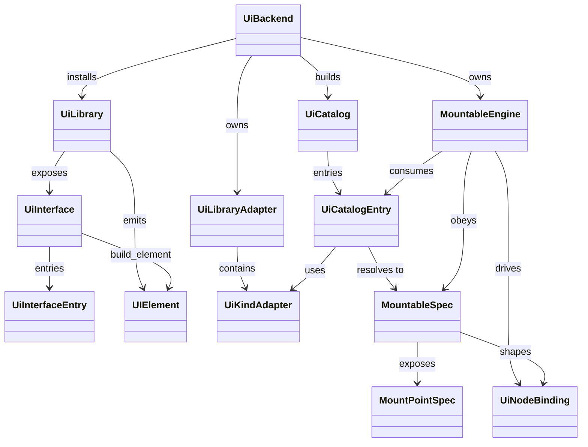
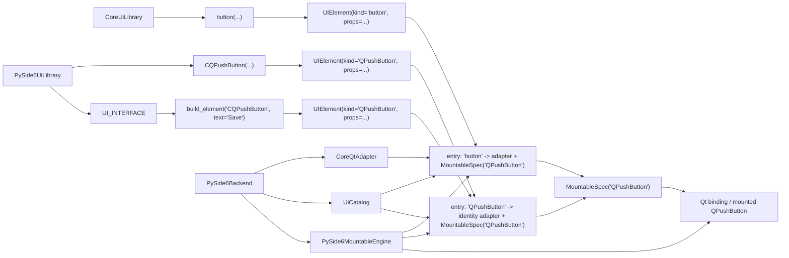

# Generic Reconciler API Proposal

## Purpose

This document proposes the public API shape for the generic reconciler and
UI-library system.

It follows:

- [GenericReconcilerRequirements.md](GenericReconcilerRequirements.md)
- [MountPointComponentDesign.md](MountPointComponentDesign.md)
- [MountableSpecModel.md](MountableSpecModel.md)
- [MountableTestingPlan.md](MountableTestingPlan.md)
- [ApiDesignRules.md](ApiDesignRules.md)
- [SemanticUiLibraryDesignRules.md](SemanticUiLibraryDesignRules.md)
- [PackageStructureRules.md](PackageStructureRules.md)

This is a proposal for the intended API shape. It is not the current
implementation.


## Current State Summary

Today:

- `UIElement` carries `kind`, `props`, `children`, `call_site_id`, and `slot_id`
- the normalized node layer already has `UiNodeDescriptorRegistry`
- the shipped backends still hard-code binding logic by `spec.kind`
- one owner tree uses one backend adapter

What is missing is the explicit API layer that ties together:

- `UiLibrary` classes
- backend support packages
- per-root installed catalogs
- backend-owned mountable spec data
- runtime compatibility checks

The current implementation and some older notes still use widget-oriented names
such as `UiWidgetSpec` and `UiWidgetEngine`. Those are historical names in the
current codebase only. The target model is:

- `MountableSpec`
- `MountableEngine`
- one implicit child list -> one built-in `standard` mount point
- widget-only attachment -> generic mount-point attachment


## Design Summary

The revised model should have seven layers:

1. **Author-facing `UiLibrary` class callables**
2. **Generated or hand-written `UIElement` emission helpers**
3. **Produced component type metadata**
4. **Backend-owned `UiLibraryAdapter` mappings**
5. **Backend-owned `MountableSpec` and `MountPointSpec` data**
6. **Per-root `UiCatalog`**
7. **One `UiBackend` per render root**

The most important rules are:

- one render root uses one backend implementation
- one render root may install many `UiLibrary` classes
- duplicate `kind` names are rejected during installation
- `UIElement` does not need a separate library id if `kind` uniqueness is
  enforced per root
- backend modules own mountable, mount-point, and prop spec dataclasses
- the packed-`kwds` wrapper optimization is internal and source-triggered
- current child handling is just the built-in `standard` mount point


## Terminology

### `UiLibrary`

An author-facing class namespace containing `@pyrolyze` UI callables.

Examples:

- `CoreUiLibrary`
- `PySide6UiLibrary`
- `TkinterUiLibrary`

### `UiBackend`

A backend implementation for one toolkit family.

Examples:

- `PySide6Backend`
- `TkBackend`

### `UiCatalog`

A per-root flattened lookup table built from the installed UI libraries and the
selected backend.

### `UiCatalogEntry`

A per-source-kind resolved catalog entry containing the adapter mapping and the
target mountable spec.

### `UiLibraryAdapter`

A backend-owned mapping layer from one source `UiLibrary` surface onto one
backend-normalized widget surface.

### `MountableSpec`

An immutable backend-owned description of one installed mountable kind.

### `UiPropSpec`

An immutable backend-owned description of one prop on one mountable kind.


## Core API Proposal

## 1. `UIElement`

`UIElement` can remain small if per-root installation guarantees unique `kind`
names.

Proposed shape:

```python
@dataclass(frozen=True, slots=True)
class UIElement:
    kind: str
    props: dict[str, Any]
    children: tuple["UIElement", ...] = ()
    call_site_id: int | str | None = None
    slot_id: Any | None = None
```

Notes:

- `UIElement` stays backend-agnostic
- `kind` is resolved through the installed `UiCatalog`
- no backend object references are stored on the element
- if kind collisions become a real problem later, qualification can be added
  then


## 2. `UiLibrary` Class Shape

The preferred author-facing shape is a class namespace.

Example:

```python
class PySide6UiLibrary:
    @classmethod
    @pyrolyze
    def CQPushButton(
        cls,
        text: str,
        *,
        flat: bool | None = None,
    ) -> None:
        call_native(cls.__element)(
            kind="QPushButton",
            text=text,
            flat=flat,
        )
```

Rules:

- one public `@pyrolyze` callable per UI element
- explicit parameters for IDE support
- the class is the author-facing grouping mechanism
- the class may be generated for toolkit-backed surfaces

Generated toolkit callable naming should be explicit and mechanically derived.

Recommended canonical rule:

- prefix concrete toolkit callables with `C`
- preserve the underlying toolkit class name after the prefix

Examples:

- `QPushButton -> CQPushButton`
- `QTabWidget -> CQTabWidget`
- `ttk.Treeview -> CTreeview`

Dropping a trailing `Widget` may be offered later as an aliasing convenience,
but it should not be the canonical generated name because it loses fidelity and
can create collisions.

A preliminary interface manifest should sit on the generated class so the
generated `UiLibrary` can be tested directly before full backend installation.

Illustrative shape:

```python
@dataclass(frozen=True, slots=True)
class UiInterfaceEntry:
    public_name: str
    kind: str


@dataclass(frozen=True, slots=True)
class UiInterface:
    name: str
    owner: type[Any]
    entries: frozendict[str, UiInterfaceEntry]

    def build_element(self, public_name: str, /, **props: Any) -> UIElement: ...


def ui_interface(cls: type[Any]) -> type[Any]: ...
```

Recommended `@ui_interface` responsibilities:

- attach one `UI_INTERFACE` manifest to the class
- record the generated public callable names and their target widget kinds
- expose a direct `build_element(...)` path for tests and tooling
- validate that the class has the expected internal `__element(...)` helper

This is intentionally smaller than the full backend model. It exists so the
generated `UiLibrary` can be tested for:

- naming
- bookkeeping
- direct `UIElement` generation

Representative example:

```python
@ui_interface
class PySide6UiLibrary:
    @classmethod
    def __element(cls, *, kind: str, **kwds: Any) -> UIElement:
        return UIElement(kind=kind, props=dict(kwds))

    @classmethod
    @pyrolyze
    def CQPushButton(
        cls,
        text: str,
        *,
        flat: bool | None = None,
        enabled: bool | None = None,
    ) -> None:
        call_native(cls.__element)(
            kind="QPushButton",
            text=text,
            flat=flat,
            enabled=enabled,
        )

    @classmethod
    @pyrolyze
    def CQLabel(
        cls,
        text: str,
        *,
        wordWrap: bool | None = None,
        openExternalLinks: bool | None = None,
    ) -> None:
        call_native(cls.__element)(
            kind="QLabel",
            text=text,
            wordWrap=wordWrap,
            openExternalLinks=openExternalLinks,
        )
```

Expected generated/interface bookkeeping:

```python
PySide6UiLibrary.UI_INTERFACE == UiInterface(
    name="PySide6UiLibrary",
    owner=PySide6UiLibrary,
    entries=frozendict(
        {
            "CQPushButton": UiInterfaceEntry(
                public_name="CQPushButton",
                kind="QPushButton",
            ),
            "CQLabel": UiInterfaceEntry(
                public_name="CQLabel",
                kind="QLabel",
            ),
        }
    ),
)
```

Direct test path:

```python
PySide6UiLibrary.UI_INTERFACE.build_element(
    "CQPushButton",
    text="Save",
    enabled=True,
)
# -> UIElement(kind="QPushButton", props={"text": "Save", "enabled": True})
```


## 3. Internal `__element` Helper

Each generated or hand-written `UiLibrary` may define an internal
`cls.__element(...)` helper responsible for building `UIElement`.

Default form:

```python
@classmethod
def __element(cls, *, kind: str, **kwds: Any) -> UIElement:
    return UIElement(kind=kind, props=dict(kwds))
```

Optimized form:

```python
@classmethod
def __element(
    cls,
    *,
    kind: str,
    parent: QWidget | None = None,
    kwds: dict[str, object],
) -> UIElement:
    return UIElement(
        kind=kind,
        props={
            "parent": parent,
            **kwds,
        },
    )
```

Notes:

- `__element` is internal to the class
- it is the only place where `UIElement.props` should be assembled
- it is also the source trigger for the packed-`kwds` optimization


## 4. Packed-`kwds` Optimization Trigger

The optimization is selected by source shape, not by environment variable.

Trigger rule:

- the authored helper is `cls.__element(...)`
- the helper has a trailing keyword-only parameter named `kwds`
- any named parameters before `kwds` remain explicit
- the matching `@pyrolyze` wrapper is a thin native wrapper around that helper

Then the compiler may lower the private runtime function to use packed keyword
forwarding.

Illustrative lowered shape:

```python
@classmethod
def __pyr_CQPushButton(cls, __pyr_ctx, __pyr_dirty_state, kwds):
    with __pyr_ctx.pass_scope():
        __pyr_ctx.call_native(
            cls.__element,
            kind="QPushButton",
            kwds=kwds,
        )
```

The public callable remains explicit and typed.

A transform/debug flag should be able to disable this optimization and fall
back to the current explicit lowering.


## 5. `UiBackend`

Each render root uses one backend instance.

Proposed shape:

```python
class UiBackend(Protocol):
    backend_id: str

    def install_library(
        self,
        library: type[Any],
        *,
        adapter: "UiLibraryAdapter | None" = None,
    ) -> None: ...
    def build_catalog(self) -> "UiCatalog": ...
    def create_binding(self, spec: UiNodeSpec, *, parent_binding: UiNodeBinding | None) -> UiNodeBinding: ...
    def can_reuse(self, current: UiNode, next_spec: UiNodeSpec) -> bool: ...
    def assert_ui_thread(self) -> None: ...
    def post_to_ui(self, callback: Callable[[], None]) -> None: ...
```

Notes:

- one backend per root
- many installed libraries per backend
- no mixed backends inside one reconciled owner tree


## 6. `UiLibraryAdapter`

This is the missing bridge for portable/core UI libraries.

Example:

- source kind: `button`
- target kind in a Qt backend: `QPushButton`
- source prop: `label`
- target prop: `text`

Proposed shape:

```python
@dataclass(frozen=True, slots=True)
class UiValueAdapter:
    source_names: tuple[str, ...]
    target_name: str
    transform: Callable[..., Any] | None = None


@dataclass(frozen=True, slots=True)
class UiKindAdapter:
    source_kind: str
    target_kind: str
    prop_adapters: frozendict[str, UiValueAdapter]


@dataclass(frozen=True, slots=True)
class UiLibraryAdapter:
    source_library: type[Any]
    kind_adapters: frozendict[str, UiKindAdapter]
```

Rules:

- adapters are backend-owned
- adapters map source props into the target mountable surface
- the target `MountableSpec` decides create/update/remount behavior
- direct toolkit libraries may use an identity adapter
- portable/core libraries use explicit adapters

This keeps:

- author-facing `UiLibrary` APIs stable
- backend widget behavior localized in backend-owned specs
- current cross-platform element APIs usable inside one concrete backend


## 7. Per-Root Registration

Registration should be explicit.

Proposed usage:

```python
backend = PySide6Backend()
backend.install_library(CoreUiLibrary, adapter=CoreQtAdapter)
backend.install_library(PySide6UiLibrary)

catalog = backend.build_catalog()
ctx = RenderContext(..., ui_backend=backend, ui_catalog=catalog)
```

Installation-time validation must:

- collect all element kinds contributed by the installed libraries
- reject duplicate source kinds
- resolve one adapter per installed library:
  - explicit adapter for portable libraries
  - identity adapter for direct toolkit libraries
- verify each source kind resolves to a known target mountable kind
- verify the backend can produce a `MountableSpec` for each resolved target kind

The backend does not assume that all installed `UiLibrary` classes are the
same. It only requires that they can all be normalized into one coherent
catalog for that backend.

That means:

- `CoreUiLibrary.button` may resolve to `QPushButton`
- `PySide6UiLibrary.CQPushButton` may also resolve to `QPushButton`
- both are valid as long as their source kinds are distinct and both resolve to
  backend-known mountable specs


## 8. `UiCatalog`

`UiCatalog` is the per-root flattened lookup table used by normalization and
reconciliation.

Proposed shape:

```python
@dataclass(frozen=True, slots=True)
class UiCatalogEntry:
    source_kind: str
    adapter: UiKindAdapter
    mountable_spec: MountableSpec


@dataclass(frozen=True, slots=True)
class UiCatalog:
    entries: frozendict[str, UiCatalogEntry]
```

Notes:

- keyed by source `UIElement.kind`
- many source kinds may resolve to the same target `MountableSpec`
- built from installed UI libraries plus backend support
- hot path uses this, not library reflection


## 9. Backend-Owned Spec Types

The new primary backend abstractions are:

- `MountableSpec`
- `MountPointSpec`
- `MountParamSpec`
- `MountState`

Mountable metadata belongs to the backend module, not to generated library
code.

Proposed backend-side dataclasses:

```python
from dataclasses import dataclass
from enum import StrEnum
from frozendict import frozendict


class PropMode(StrEnum):
    CREATE_ONLY = "create_only"
    CREATE_ONLY_REMOUNT = "create_only_remount"
    UPDATE_ONLY = "update_only"
    CREATE_UPDATE = "create_update"
    READONLY = "readonly"


class ChildPolicy(StrEnum):
    NONE = "none"
    ORDERED = "ordered"
    SINGLE = "single"


@dataclass(frozen=True, slots=True)
class TypeRef:
    expr: str
    value: object | None = None


@dataclass(frozen=True, slots=True)
class UiPropSpec:
    name: str
    annotation: TypeRef | None
    mode: PropMode
    constructor_name: str | None = None
    setter_name: str | None = None
    getter_name: str | None = None
    affects_identity: bool = False


@dataclass(frozen=True, slots=True)
class MountableSpec:
    kind: str
    mounted_type_name: str
    props: frozendict[str, UiPropSpec]
    mount_points: frozendict[str, MountPointSpec]
```

Notes:

- `MountableSpec` is the encompassing immutable spec for one produced mountable
  kind
- `UiPropSpec` is the per-prop rule set
- `frozendict` keeps spec maps immutable and explicit
- the backend may extend these types with future fields as needed
- `annotation` should use `TypeRef`, with:
  - `expr` as the stable textual form
  - `value` as the resolved Python annotation when available


## 10. Prop Modes

Each prop must be classified as:

- `dynamic`
  - update in place
- `init_only`
  - if changed, remount
- `readonly`
  - not author-settable

For toolkit-backed generated libraries:

- constructor parameters should be available in the generated callable surface
- writable setter/property values should also be available in that surface
- readonly values should not be author-settable

This matches the current PyRolyze rule that one declarative prop surface is
used for both creation and update.


## 11. Toolkit Discovery

The generator should use real toolkit metadata.

Examples:

- PySide6:
  - `.pyi` signatures
  - `QMetaObject` property data
- tkinter:
  - constructor signatures
  - configure/option surface

The generator should output:

- explicit author-facing callable signatures
- enough backend-owned spec data to classify each prop correctly


## 12. Composite Mountables

Composite mountables that are native-backend compatible but internally composed
must still appear as one node to the reconciler.

Required backend binding contract:

- expose one head/native value for parent attachment
- `update_props(...)`
- `place_child(child, index)`
- `detach_child(child)`
- `dispose()`

This is sufficient for the current single child-region model.

A custom composite Qt mountable should therefore be able to:

- attach to the parent as one node
- place children into whatever internal layout/host it actually uses
- reorder children through repeated `place_child(..., index)` calls


## 13. Coexistence With Current Built-Ins

The current built-in node set should be treated as one installed `UiLibrary`,
not as a permanent special case.

For example:

- `CoreUiLibrary`
- `PySide6UiLibrary`

may both be installed into one `PySide6Backend`, provided their `kind` names do
not collide.


## 14. `CoreQtAdapter` Example

An abstract cross-platform library should map into the backend's normalized
widget surface through an explicit adapter.

Illustrative shape:

```python
CoreQtAdapter = UiLibraryAdapter(
    source_library=CoreUiLibrary,
    kind_adapters=frozendict(
        {
            "button": UiKindAdapter(
                source_kind="button",
                target_kind="QPushButton",
                prop_adapters=frozendict(
                    {
                        "text": UiValueAdapter(source_names=("label",), target_name="text"),
                        "enabled": UiValueAdapter(source_names=("enabled",), target_name="enabled"),
                        "visible": UiValueAdapter(source_names=("visible",), target_name="visible"),
                        "clicked": UiValueAdapter(source_names=("on_press",), target_name="clicked"),
                    }
                ),
            ),
            "section": UiKindAdapter(
                source_kind="section",
                target_kind="QGroupBox",
                prop_adapters=frozendict(
                    {
                        "title": UiValueAdapter(source_names=("title",), target_name="title"),
                        "visible": UiValueAdapter(source_names=("visible",), target_name="visible"),
                    }
                ),
            ),
        }
    ),
)
```

Notes:

- the adapter is responsible for prop-name translation
- the target `MountableSpec` is responsible for remount/update rules
- unsupported source props must either be transformed, ignored intentionally,
  or fail installation explicitly
- backend-specific composites may also be target kinds


## 15. Backend Package Layout

The new backend implementation should live under:

```text
src/pyrolyze/backends/
    __init__.py
    model.py
    pyside6/
        __init__.py
        backend.py
        engine.py
        adapters.py
        bindings.py
        mountables.py
        mount_points.py
        generated_library.py
        learnings.py
    tkinter/
        __init__.py
        backend.py
        engine.py
        adapters.py
        bindings.py
        mountables.py
        mount_points.py
        generated_library.py
        learnings.py
```

Recommended responsibilities:

- `model.py`
  - shared dataclasses and enums such as:
    - `UiInterface`
    - `UiInterfaceEntry`
    - `UiCatalog`
    - `UiCatalogEntry`
    - `UiLibraryAdapter`
    - `UiKindAdapter`
    - `UiValueAdapter`
- `backend.py`
  - backend installation, catalog building, and toolkit event-loop integration
- `engine.py`
  - the create/update/remount machinery for one backend
- `adapters.py`
  - `CoreQtAdapter`, `CoreTkAdapter`, and any other portable-library adapters
- `bindings.py`
  - concrete mounted-value bindings
- `mountables.py`
  - backend-owned `MountableSpec` / `UiPropSpec` / `UiMethodSpec` data
- `mount_points.py`
  - backend-owned `MountPointSpec` / `MountParamSpec` / `MountState` data
- `generated_library.py`
  - generated `PySide6UiLibrary` / `TkinterUiLibrary`
- `learnings.py`
  - persistent constructor-to-setter and grouping corrections

The existing files:

- [pyrolyze_pyside6.py](../src/pyrolyze/pyrolyze_pyside6.py)
- [pyrolyze_tkinter.py](../src/pyrolyze/pyrolyze_tkinter.py)

should be replaced by the new backend packages once the new layout is adopted.
Backward compatibility is not a design constraint for this refactor because the
current clients are in this repository.

The generator tools should remain outside the package runtime in:

```text
pyrolyze_tools/
    generate_semantic_library.py
    rebuild_backend_libraries.py
```

Recommended rebuild flow:

1. dump raw toolkit constructor/property/method surfaces
2. apply `learnings.py`
3. generate `generated_library.py`
4. regenerate or verify `mountables.py`


## 16. `MountableEngine`

The backend needs a dedicated engine layer that is separate from:

- author-facing `UiLibrary`
- source-to-target `UiLibraryAdapter`
- concrete binding classes

Recommended name:

- `MountableEngine`

Responsibility:

- create mounted nodes from `UiCatalogEntry + UIElement + slot_id + call_site_id`
- update existing nodes by applying prop and method diffs
- remount when `MountableSpec` requires it
- preserve the node's position in the parent graph during remount
- hand child placement and disposal off to the binding layer
- apply built-in `standard` child mounts
- apply explicit mount-point state for non-child attachment

The engine should be backend-specific in implementation:

- `PySide6MountableEngine`
- `TkinterMountableEngine`

but share the same conceptual role.


## 17. Testing Strategy

Testing needs to be broader than ordinary wrapper tests. The detailed plan now
belongs in
[MountableTestingPlan.md](MountableTestingPlan.md).

Recommended layers:

1. `UiInterface` tests
   - verify `@ui_interface` bookkeeping
   - verify generated public-name -> widget-kind registration
   - verify direct `UIElement` generation through `UI_INTERFACE.build_element(...)`

2. Spec extraction tests
   - verify `.pyi` / property / setter discovery
   - verify generated callable signatures
   - verify `learnings.py` overlay application

3. Adapter tests
   - verify `CoreQtAdapter` and `CoreTkAdapter` map source props correctly
   - verify unsupported props fail clearly

4. `MountableEngine` unit tests
   - create -> node + key
   - update -> setter/property path
   - remount -> preserve parent position and replace binding cleanly
   - grouped setter partial update behavior

5. Mountable-spec conformance tests
   - for every mountable kind:
     - every constructor input
     - every setter/property input
     - every readable getter/property
   - verify the mapping really works against the live toolkit

6. Crash-isolated toolkit matrix tests
   - Qt can crash the interpreter
   - suspicious widget/spec tests should run in a subprocess
   - each subprocess case must report:
     - widget kind
     - constructor or setter name
     - parameter set
     - crash / pass / failure result

7. Reconciliation integration tests
   - mount/update/remount through the real backend
   - portable `CoreUiLibrary` + backend adapter path
   - direct generated toolkit-library path
   - composite widget path

Suggested layout:

```text
tests/backends/
    pyside6/
        test_adapter_mapping.py
        test_catalog_build.py
        test_mountable_engine.py
        test_generated_library_surface.py
        test_mountable_spec_matrix.py
        test_mountable_spec_matrix_subprocess.py
    tkinter/
        test_adapter_mapping.py
        test_catalog_build.py
        test_mountable_engine.py
        test_generated_library_surface.py
        test_mountable_spec_matrix.py
```

For the crash-isolated matrix, a helper runner should emit one structured
result per case so failures can be traced back to:

- widget kind
- operation type
- constructor or setter name
- concrete argument payload


## 18. Relationship Graphs

### Class / Model Graph



### Instance Graph




## How The Reconciler Uses This

The reconciler should not consult `UiLibrary` classes directly in the hot path.

Instead:

1. backend installs libraries
2. backend resolves adapters and builds `UiCatalog`
3. normalization resolves `UIElement.kind` to a `UiCatalogEntry`
4. the catalog entry maps source props into the target mountable surface
5. reconciliation uses the resolved `MountableSpec`, mount points, and binding factories

So the flow is:

```text
UiLibrary classes
    -> backend installation
    -> UiLibraryAdapter resolution
    -> UiCatalogEntry
    -> normalize UIElement(kind, props)
    -> target mountable props
    -> reconcile using mountable specs + bindings + mount points
```


## 19. Revised Direction

The new working direction is:

- `MountableSpec` is the primary abstraction
- the ordinary child list is the built-in `standard` mount point
- explicit attachment APIs are modeled as `MountPointSpec`
- produced component types are carried through `ComponentMetadata.emitted_type`
- mount compatibility is checked against `MountPointSpec.accepted_produced_type`

This lets the reconciler handle:

- ordinary retained props
- ordered children
- single-object attachment
- parameterized attachment sites
- future non-widget produced native values


## 20. Implementation Migration Plan

The current implementation should be brought forward in this order.

### Phase 1. Rename the core concepts

- `UiWidgetSpec` -> `MountableSpec`
- `UiWidgetEngine` -> `MountableEngine`
- `UiWidgetLearning` -> `MountableLearning`
- `WIDGET_SPECS` -> `MOUNTABLE_SPECS`
- widget-oriented doc language -> mountable-oriented doc language

This is a breaking rename and should be done directly rather than via aliases.

### Phase 2. Introduce produced type metadata

- extend `ComponentMetadata` with `emitted_type: TypeRef | None`
- change `pyrolyze` from a simple function to a decorator object supporting:
  - bare `@pyrolyze`
  - explicit `@pyrolyze[T]`
- default bare emitted type becomes `WidgetResult` or the equivalent default
  mountable type

### Phase 3. Introduce mount-point model types

- add `MountParamSpec`
- add `MountPointSpec`
- add `MountState`
- add backend parent-type mount registries
- define the built-in `standard` mount point for existing ordered children

### Phase 4. Rework the engine around mount points

- current child handling becomes the built-in `standard` mount point
- engine applies mount-point state, not just `children`
- canonical API becomes:
  - `apply(parent, state)`
  - optional batch `sync(parent, states)` fast path
- keep `place/detach` as fallback primitives only

### Phase 5. Rework the extraction/generation pipeline

- current widget extraction becomes mountable extraction
- keep ordinary prop/method extraction for value-like parameters
- add mount-point discovery for object-attachment APIs
- apply `learnings.py` to refine generated mount points
- regenerate backend libraries and backend mountable specs

### Phase 6. Migrate current backend packages

- `src/pyrolyze/backends/pyside6/engine.py`
  - rename/rework to `MountableEngine`
- `src/pyrolyze/backends/model.py`
  - rename widget terms to mountable terms
  - move mount-point dataclasses into the shared backend model or a dedicated
    mount-point model module
- `src/pyrolyze/backends/pyside6/learnings.py`
  - rename `UiWidgetLearning` usage to `MountableLearning`
- `src/pyrolyze/backends/pyside6/generated_library.py`
  - rename `WIDGET_SPECS` to `MOUNTABLE_SPECS`
  - emit mountable terminology throughout generated constants and annotations
- `pyrolyze_tools/generate_semantic_library.py`
  - emit `MountableSpec` terminology and mount-point data
- generated `pyside6` / `tkinter` libraries
  - emit produced type metadata
  - emit mount-point metadata

### Phase 7. Update test names and coverage

- rename widget-engine/spec tests to mountable-engine/spec tests
- add tests for:
  - produced type metadata
  - mount-point registry lookup
  - duplicate mount-instance rejection
  - rollback on mount-point failure
  - mount-point apply/sync behavior

### Phase 8. Adopt the new mountable model note

- use
  [MountableSpecModel.md](MountableSpecModel.md)
  as the lower-level runtime model note
- keep
  [UiWidgetSpecModel.md](obsolete/UiWidgetSpecModel.md)
  archived only as historical context


## Future Proposals

Useful but intentionally deferred:

- qualified kind names if collisions become common
- helper decorators that generate class-level library metadata
- richer generated event metadata and signal discovery
- additional tooling around generated library review and trimming
