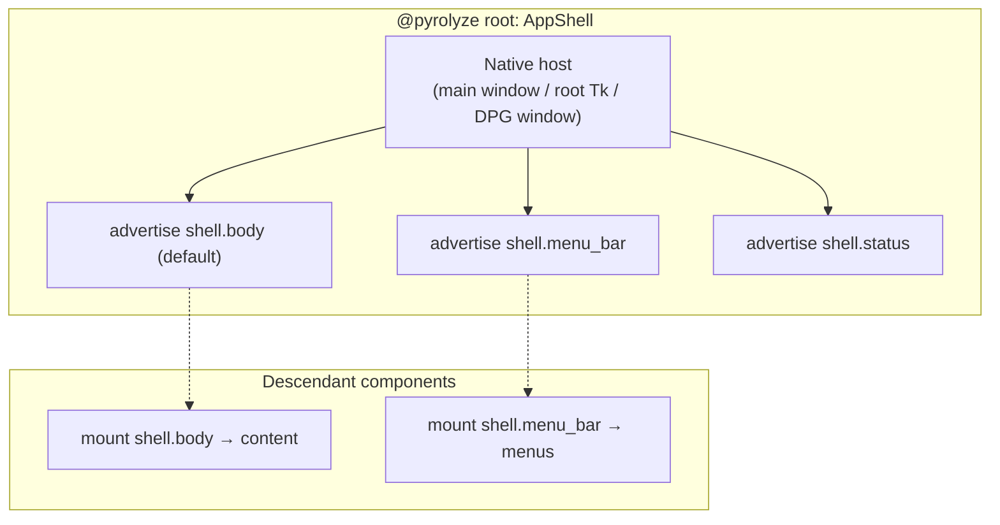

# Reference shell layout (canonical mount keys)

## Purpose

Single place that ties together:

- **Which mount keys** authors use for a minimal app shell (`pyrolyze.unified.mount_keys`).
- **How the PyRolyze tree advertises** those keys relative to a root layout component.
- **How each backend attaches** `advertise_mount(..., target=...)` to a real
  `MountSelector` (generated `*UiLibrary.mounts`, or named logical slots).

This is the **design slice** for Phase 2 of `dev-docs/UnifiedComplete.md`
(reference layout E2E tests live under `tests/unified/e2e/`).

**Window lifetime** (multi-window, user-close, proxy handles) is **not** defined
here — see `dev-docs/ReactiveRootWindowProxy.md`. This doc only covers **one**
logical top-level shell and **interior** mount regions.

---

## Canonical keys (author vocabulary)

Use the **string values** from `pyrolyze.unified.mount_keys` as the **first
argument** to `advertise_mount` (or the `key=` argument if using keyword form).

| Constant | String value | Role |
| --- | --- | --- |
| `SHELL_MENU_BAR` | `shell.menu_bar` | Top menu strip (when present). |
| `SHELL_BODY` | `shell.body` | Primary content / document area. |
| `SHELL_STATUS` | `shell.status` | Status / footer line. |
| `SHELL_CHROME` | `shell.chrome` | Extra chrome (toolbars, title-adjacent strips) when distinct from menu bar. |
| `DIALOG_CONTENT` | `dialog.content` | Dialog main body. |
| `DIALOG_ACTIONS` | `dialog.actions` | Dialog action row (OK / Cancel). |

**Naming note:** Older prose may say “body” or “chrome” alone; new material
should prefer the **`shell.*` / `dialog.*`** strings above so keys stay
namespaced and grep-friendly.

---

## Reference component tree

Authors implement a **root shell component** that:

1. Emits a small **native** host for the toolkit (main window, `Tk` hierarchy,
   DPG window / viewport — bootstrap-specific).
2. **Advertises** the shell keys so children can `mount("shell.body", ...)`
   (etc.) into stable slots.

### Logical tree (mermaid)

The **advert graph** is the important part; native chrome is implied by the host.



**Order:** Typically advertise **menu bar** and **body** from the same render
pass as the host; children run in deeper slots and perform **`mount`** into the
advertised keys.

### Minimal author shape (pseudocode)

```python
from pyrolyze.api import advertise_mount, call_native, mount, pyrolyze
from pyrolyze.unified import get_unified_native_library, mount_keys

Lib = get_unified_native_library()  # qt / tk / dpg from env or explicit

@pyrolyze
def app_shell():
    # 1) Create toolkit host (native) — pattern varies by backend; often call_native.
    # 2) Bind selectors (see per-backend table below) to local names.
    # 3) Advertise canonical keys → those selectors.
    with host_surface():  # pseudocode
        advertise_mount(mount_keys.SHELL_MENU_BAR, target=SELECTOR_MENU_BAR, default=False)
        advertise_mount(mount_keys.SHELL_BODY, target=SELECTOR_BODY, default=True)
        advertise_mount(mount_keys.SHELL_STATUS, target=SELECTOR_STATUS, default=False)
```

Concrete `host` components and `call_native` kinds are exercised in
**`tests/unified/e2e/test_reference_shell_layout.py`** (Qt `QWidget` +
`PySide6UiLibrary.mounts`, Tk `ttk_Frame` + named selectors, DPG `DpgWindow` +
named selectors).

---

## Per backend: how to attach selectors

### PySide6 (`PySide6UiLibrary`)

Generated **`PySide6UiLibrary.mounts`** includes selectors that map cleanly to
a **`QMainWindow`**-style shell:

| Canonical key | Typical `target=` selector | Notes |
| --- | --- | --- |
| `shell.menu_bar` | `PySide6UiLibrary.mounts.menu_bar` | Menu bar region. |
| `shell.body` | `PySide6UiLibrary.mounts.central_widget` | Central widget / document area. |
| `shell.status` | `PySide6UiLibrary.mounts.status_bar` | Status bar slot. |
| `shell.chrome` | `PySide6UiLibrary.mounts.corner_widget` or `title_bar_widget` | Pick one documented pattern per app; not all apps need this advert. |

Import path: `from pyrolyze.backends.pyside6.generated_library import PySide6UiLibrary`.

### Tkinter (`TkinterUiLibrary`)

Generated **`TkinterUiLibrary.mounts`** is **geometry-oriented** (`grid`,
`pack`, `pane`, `tab`) — it does **not** name `menu_bar` or `central_widget`.

**Pattern:** At bootstrap, create explicit hosts (`tk.Menu` on `Tk`,
`ttk.Frame` client area, `ttk.Label` status) and expose each as a
**`MountSelector.named("…")`** stable name used only inside your app (or test),
e.g.:

| Canonical key | Typical `target=` | Notes |
| --- | --- | --- |
| `shell.menu_bar` | `MountSelector.named("tk_shell_menu_bar")` | Bind this name to the menu child of `Tk` / `Toplevel` in native setup. |
| `shell.body` | `MountSelector.named("tk_shell_body")` | Bind to the main `Frame` / `ttk.Frame` you pack/grid as client area. |
| `shell.status` | `MountSelector.named("tk_shell_status")` | Bind to status `ttk.Label` or frame. |

The **string** passed to `advertise_mount` remains **`mount_keys.SHELL_*`**; the
**target** is your named selector that the **mount engine** resolves to the
correct widget after native construction.

### Dear PyGui (`DearPyGuiUiLibrary`)

**No** `DearPyGuiUiLibrary.mounts` namespace today (`unified` exposes
`mounts` as `None`). Use **`MountSelector.named(...)`** logical names for each
region and resolve them in bootstrap against DPG item tags / parent windows, e.g.:

| Canonical key | Typical `target=` | Notes |
| --- | --- | --- |
| `shell.menu_bar` | `MountSelector.named("dpg_viewport_menu_bar")` | Or per-window menu per `items.py` patterns. |
| `shell.body` | `MountSelector.named("dpg_window_body")` | Often a `add_window` client region or `add_child` host. |
| `shell.status` | `MountSelector.named("dpg_status_row")` | Row of widgets or text; toolkit-specific. |

Document the **binding** (which DPG item id owns each name) next to your host
bootstrap code.

---

## Relationship to other docs

| Document | Role |
| --- | --- |
| `dev-docs/MountKeys.md` | Table of constants + short semantics. |
| `dev-docs/UnifiedMountBasedNativeApi.md` | Why mount-first + unified adapters compose. |
| `dev-docs/ReactiveRootWindowProxy.md` | When the **shell** is a **window proxy** with independent lifetime. |
| `dev-docs/UnifiedComplete.md` | Phase tracker and exit criteria. |

---

## Next implementation steps (checklist)

- [x] `tests/unified/e2e/test_reference_shell_layout.py` — Qt, Tk, and DPG cases
      share the **same** `mount_keys` advert sequence; assert
      `RenderContext.debug_mount_advertisements()`.
- [x] Tk/DPG use **named** `MountSelector` targets (bootstrap binding is
      app-specific; tests document the pattern).
- [x] Cross-links from `MountKeys.md` and `ReactiveRootWindowProxy.md`.

---

## Document history

- **Added** as the consolidated reference for canonical shell mount layout and
  per-backend selector attachment.
