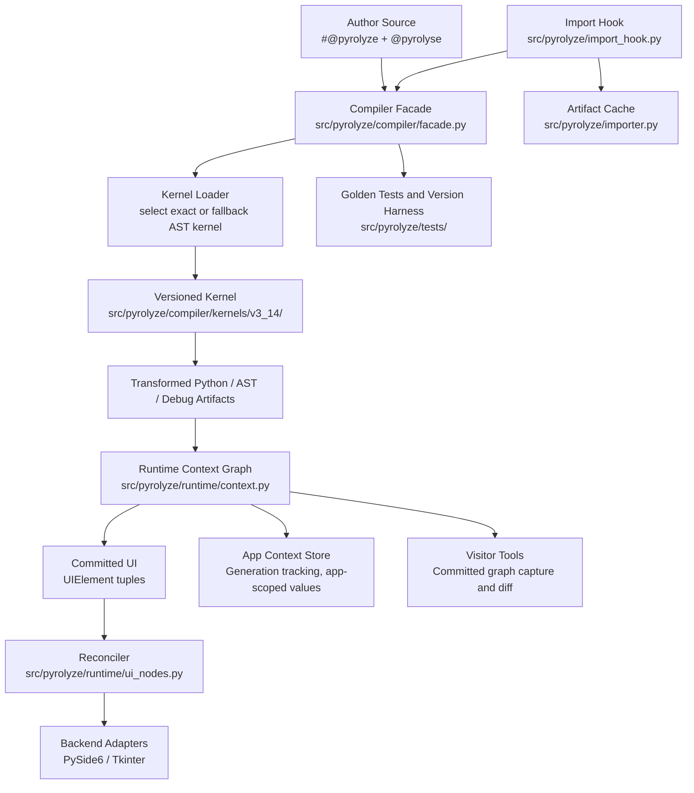

# System Map

This is the current package shape.

## Main pieces

- Source API
  - `src/pyrolyze/api.py`
  - `src/pyrolyze/hooks.py`
- Compiler
  - `src/pyrolyze/compiler/`
- Runtime
  - `src/pyrolyze/runtime/`
  - `src/pyrolyze/visitor.py`
- Backends
  - `src/pyrolyze/pyrolyze_pyside6.py`
  - `src/pyrolyze/pyrolyze_tkinter.py`
- Examples
  - `examples/grid_app.py`
  - `examples/run_grid_app.py`
- Tests
  - `tests/`

## Read next

- [../design/Architecture.md](../design/Architecture.md)
- [../user/Authoring_Overview.md](../user/Authoring_Overview.md)
- [../contributor/Versioned_Test_Runs.md](../contributor/Versioned_Test_Runs.md)
